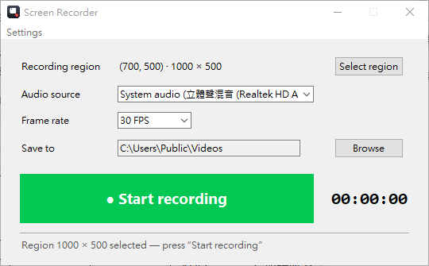
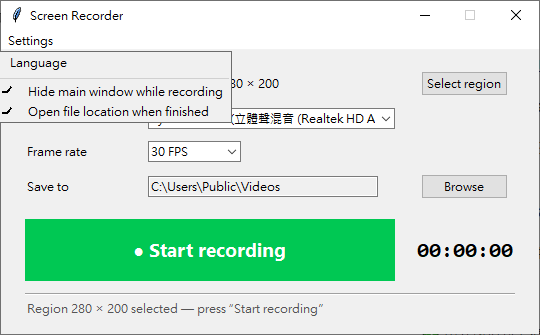
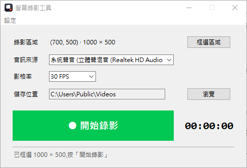
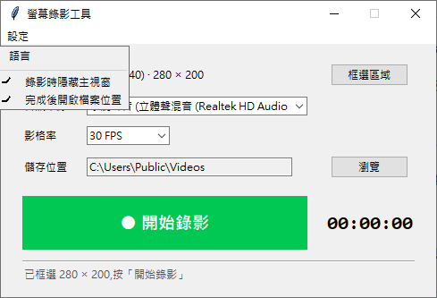

# Screen Recorder / 螢幕錄影工具

  

A single-exe Windows screen recorder: select any region, record system audio at the same time, export MP4 (H.264 + AAC). UI available in **English (default)** and **繁體中文**.

單一 exe 的 Windows 螢幕錄影工具:可任意框選範圍、同步錄製系統聲音,輸出 MP4 (H.264 + AAC)。介面提供**英文(預設)**與**繁體中文**。



---

## English

### Features

- ✅ **Screen recording** — GPU-accelerated capture (DXGI Desktop Duplication, up to 60 fps at 1080p) with automatic GDI fallback
- ✅ **Any region selection** — semi-transparent mask; the whole screen stays visible while dragging (the selected area shows the desktop through), with live size and crosshair
- ✅ **Recording outline** — a green dashed rectangle marks the region on screen and stays visible during recording; it is drawn outside the region (never captured) and is fully mouse-transparent
- ✅ **Single exe** — no Python installation needed; custom app icon (exe and window title bar)
- ✅ **Synchronized audio** — system audio via WASAPI loopback (original digital volume, always stereo, works on any PC without a Stereo Mix device) or a microphone
- ✅ **English / 繁體中文 UI** — switchable via the menu bar (*Settings ▸ Language*); the choice is remembered per user
- ✅ **Settings are remembered** — save location, language, last region, frame rate and both recording options are stored in a settings file and restored on the next launch

### Usage

**Run the exe**

```
dist\ScreenRecorder.exe
```

1. Click **Select region** — the screen dims (the desktop stays clearly visible); drag out the area to record (live width × height, ESC cancels)
2. A **green dashed rectangle** now marks the region; it remains visible while recording and does not block the mouse
3. Choose the **audio source** (default *System audio* = the sound the video is playing) and the **frame rate**
4. Click **● Start recording** — if *Settings ▸ Hide main window while recording* is on, a draggable floating control bar appears at the bottom-right
5. Click **■ Stop** — the file is saved, and its folder opens automatically if *Settings ▸ Open file location when finished* is on

> Selecting a region again replaces it; canceling keeps the previous one.

Files are saved to `Users\<you>\Videos\ScreenRecording_YYYYMMDD_HHMMSS.mp4` by default.

**Settings menu (menu bar)**

| Menu item | Behavior |
|---|---|
| **Settings ▸ Language ▸ English / 繁體中文** | Switch the UI language; remembered for next launch |
| **Settings ▸ Hide main window while recording** | Click to toggle; when on, recording hides the main window and shows the floating bar |
| **Settings ▸ Open file location when finished** | Click to toggle; when on, Explorer opens at the saved file after *Stop* |



**Settings file**

Preferences (save location, language, last selected region, both toggles, frame rate) are stored in:

```
%APPDATA%\ScreenRecorder\config.json
```

It is created automatically on first launch; every later launch loads and applies it — no need to set things up twice. The file is plain JSON (safe to edit by hand); delete it to reset everything to defaults.

**Example: record a YouTube video**

1. Open the browser and play the video on YouTube
2. Back in this tool, click *Select region* and frame the video area → click *Start recording*
3. The video's sound is recorded in sync (audio source = *System audio*)
4. Click *Stop* → an MP4 file is produced

**Command line (advanced)**

```bat
:: headless self test (verifies the exe; exit code 0 = pass)
ScreenRecorder.exe --selftest

:: record a region for 10 seconds
ScreenRecorder.exe --record --left 0 --top 0 --width 1280 --height 720 ^
    --seconds 10 --fps 30 --audio system --output D:\out.mp4

:: --audio: system | none | mic:<index>
:: --lang:   en | zh  (sets UI language, remembered)
```

**Run from source**

```bat
python -m venv .venv
.venv\Scripts\pip install -r requirements.txt
.venv\Scripts\python main.py            :: GUI (English by default)
.venv\Scripts\python main.py --lang zh  :: switch to 繁體中文
```

### Build the exe

```bat
build.bat
```

or manually:

```bat
.venv\Scripts\python -m PyInstaller --noconfirm --clean --onefile --windowed ^
    --name ScreenRecorder ^
    --icon assets\icon.ico --add-data "assets;assets" ^
    --collect-all av --collect-all dxcam --collect-data sounddevice ^
    main.py
dist\ScreenRecorder.exe --selftest
```

Output: `dist\ScreenRecorder.exe` (about 58 MB, icon embedded).

**Replace the icon**

```bat
copy your_icon.ico assets\icon.ico
build.bat
```

The window icon reads `assets\icon.png` (256 px) — replace both to keep them consistent.
This project's icon can be regenerated from the source artwork: `python tools\make_icon.py`.

### Project structure

| File | Description |
|---|---|
| `main.py` | Entry point: GUI / `--selftest` / `--record` CLI / `--lang` |
| `config.py` | Settings file: defaults, validation, load/save (`%APPDATA%\ScreenRecorder\config.json`) |
| `i18n.py` | UI strings (English default / 繁體中文), language state (persisted via `config.py`) |
| `gui.py` | Main window, menu bar (Settings ▸), floating control bar, settings persistence |
| `region_ui.py` | Fullscreen region selector + green dashed outline |
| `recorder.py` | Capture, encoding, MP4 output |
| `audio_sources.py` | Audio device discovery and capture |
| `wasapi_loopback.py` | WASAPI loopback recording (ctypes COM, no extra deps) |
| `assets/` | App icons (`icon.ico`, `icon.png`, source SVG) |
| `tools/make_icon.py` | Icon generator (supersampled multi-size `.ico`) |
| `build.bat` | Packaging script (ASCII-safe batch) |
| `requirements.txt`, `.gitignore` | Dependencies / repository hygiene |

### Technical notes

- **Video**: dxcam (DXGI Desktop Duplication) → falls back to mss (GDI); capture and encoding run on separate threads, timeline anchored to wall clock (VFR)
- **Audio**: system audio prefers **WASAPI loopback** (`wasapi_loopback.py` drives Core Audio COM via ctypes — records the digital copy of what the default output device is playing; no hardware mixer needed, original volume, always stereo, silence padding keeps A/V aligned); falls back to a *Stereo Mix* device (sounddevice callback → float32 → AAC). All audio is encoded as stereo; mono inputs are duplicated to both channels
- **Encoding**: PyAV (FFmpeg) — libx264 `preset=veryfast crf=20` + AAC, faststart MP4
- **Selection UI**: two layered topmost windows — the bottom layer enables `-alpha` (dimmed mask, desktop clearly visible) and `-transparentcolor` (selected area fully see-through) at once; the top layer has no alpha so outlines, crosshair and size text stay sharp
- **Region outline**: a separate colorkey window that only draws the dashed rectangle, styled `WS_EX_TRANSPARENT | WS_EX_NOACTIVATE` (fully click-through, never steals focus, hidden from the taskbar)
- **UI languages & settings**: all strings live in `i18n.py` (English default); every preference — language, save folder, last region, frame rate, *hide main window*, *open file location* — is stored in `%APPDATA%\ScreenRecorder\config.json` (created with defaults on first run, type-validated, written atomically) and restored on the next launch; the font follows the language (Segoe UI / 微軟正黑體)
- **Icon**: base artwork is Google Material Symbols "screenshot_monitor" (Apache License 2.0); the tile gradient and red recording dot are drawn programmatically, rendered to a multi-size `icon.ico` (16–256 px) at 4× supersampling by `tools/make_icon.py`

### FAQ

**Startup takes about 10 seconds?**
A onefile exe extracts itself to a temp folder on every launch, and the first run is also scanned by antivirus (normal for unsigned exes); later launches are faster. Use `--onedir` packaging if you don't want to wait.

**No *System audio* in the audio list?**
System audio uses WASAPI loopback first (available on any PC, no extra device). Only if loopback is unavailable (systems without a configured output endpoint) does it fall back to *Stereo Mix*:
1. Windows Sound settings → Recording devices → right click → *Show Disabled Devices* → enable *Stereo Mix*

**The recording is quiet or mono?**
That means a microphone-like input was selected (names such as *Primary Sound Capture Driver* are input endpoints — they pick up sound through the air, hence quiet and usually mono). Set the audio source to ***System audio*** — loopback captures the digital signal being played, at original volume and always stereo; the program also forces stereo output for every recording (mono sources are duplicated to both channels).

**No sound in the recording?**
Make sure the audio source is *System audio* rather than *None*; if the device is exclusive to another app, close other recording/communication software first.

**File corrupt / recording failed?**
Check the status line for the error message; common causes are switching GPU/display resolution or locking the screen during recording. Regions spanning multiple monitors automatically switch to compatibility mode.

**Where are my settings stored? / How do I reset them?**
In `%APPDATA%\ScreenRecorder\config.json` — language, save folder, last region, frame rate and both recording options. The file is created on first launch; delete it to return to factory defaults.

---

## 繁體中文



### 功能

- ✅ **螢幕錄影** — GPU 加速擷取 (DXGI Desktop Duplication,1080p 可達 60fps),自動退回 GDI 相容模式
- ✅ **任意框選範圍** — 半透明遮罩,框選過程**整個螢幕都看得到**(拖曳出的區域完全穿透),即時顯示寬高與十字線
- ✅ **錄影範圍提示框** — 畫完框後螢幕上立刻顯示綠色虛線框標示錄影區塊,**錄影期間持續保留**;虛線畫在錄影區外側,不會錄進影片,且滑鼠完全穿透不影響操作
- ✅ **單一 exe 執行** — 無需安裝 Python,雙擊即可使用;附專屬程式圖示(exe 與視窗左上角統一)
- ✅ **同步錄音** — 系統聲音(WASAPI 迴圈錄音,原始數位音量、立體聲,任何電腦皆可用)或麥克風,與畫面同步輸出
- ✅ **英文 / 繁體中文介面** — 由工具列「設定 ▸ 語言」切換,選擇會記住
- ✅ **設定會記憶** — 儲存位置、語言、最後框選位置、影格率與兩個錄影選項存入設定檔,下次啟動自動套用

### 使用方法

**直接執行(exe)**

```
dist\ScreenRecorder.exe
```

1. 按 **「框選區域」** → 畫面變暗(底下畫面仍清晰可見),按住左鍵拖曳框出要錄的範圍(即時顯示寬高,按 ESC 取消)
2. 選完後螢幕上會出現**綠色虛線框**標示錄影區塊(滑鼠可正常穿越虛線操作其他視窗)
3. 選擇 **音訊來源**(預設「系統聲音」= 錄影片發出的聲音)與 **影格率**
4. 按 **「● 開始錄影」** → 虛線框在錄影期間持續保留;若「設定 ▸ 錄影時隱藏主視窗」為開啟,會出現右下角浮動控制列(可拖曳)
5. 按 **「■ 停止錄影」** → 自動存檔;若「設定 ▸ 完成後開啟檔案位置」為開啟,會自動開啟資料夾

> 重新框選可更換區域;取消框選則沿用原本區域。

檔案預設存到 `使用者\Videos\螢幕錄影_日期_時間.mp4`。

**工具列設定選單**

| 選單項目 | 行為 |
|---|---|
| **設定 ▸ 語言 ▸ English / 繁體中文** | 切換介面語言,下次啟動記住 |
| **設定 ▸ 錄影時隱藏主視窗** | 點擊切換;開啟時錄影中隱藏主視窗、顯示浮動控制列 |
| **設定 ▸ 完成後開啟檔案位置** | 點擊切換;開啟時停止錄影後自動在檔案總管選取該檔案 |



**設定檔**

偏好設定(儲存位置、語言、最後框選位置、兩個錄影選項、影格率)存於:

```
%APPDATA%\ScreenRecorder\config.json
```

首次執行自動建立,之後每次啟動讀取並套用 — 不必每次重複調整。檔案為純 JSON(可手工編輯),刪除即可回復全部預設值。

**範例:錄 YouTube 影片**

1. 開啟瀏覽器進入 YouTube 播放影片
2. 回到本工具按「框選區域」,框住影片畫面 → 按「開始錄影」
3. 錄影中影片的聲音會同步被錄進去(需音訊來源選「系統聲音」)
4. 按「停止錄影」→ 產生 MP4 檔案

**命令列模式(進階)**

```bat
:: 背景自我測試(驗證 exe 可用,結束碼 0=通過)
ScreenRecorder.exe --selftest

:: 指定區域錄 10 秒
ScreenRecorder.exe --record --left 0 --top 0 --width 1280 --height 720 ^
    --seconds 10 --fps 30 --audio system --output D:\out.mp4

:: --audio 可用值: system(系統聲音) | none(無聲) | mic:0(麥克風索引)
:: --lang:   en | zh  (設定介面語言並記住)
```

**用原始碼執行**

```bat
python -m venv .venv
.venv\Scripts\pip install -r requirements.txt
.venv\Scripts\python main.py            :: 開啟圖形介面(預設英文)
.venv\Scripts\python main.py --lang zh  :: 切換成繁體中文
```

### 重新打包 exe

```bat
build.bat
```

或手動:

```bat
.venv\Scripts\python -m PyInstaller --noconfirm --clean --onefile --windowed ^
    --name ScreenRecorder ^
    --icon assets\icon.ico --add-data "assets;assets" ^
    --collect-all av --collect-all dxcam --collect-data sounddevice ^
    main.py
dist\ScreenRecorder.exe --selftest
```

產出:`dist\ScreenRecorder.exe`(約 58 MB,含嵌入圖示)。

**更換程式圖示**

```bat
copy 你的圖示.ico assets\icon.ico
build.bat
```

視窗左上角圖示讀的是 `assets\icon.png`(256px),一併替換即可保持一致。
本專案圖示可由原始素材重新產生:`python tools\make_icon.py`。

### 檔案結構

| 檔案 | 說明 |
|---|---|
| `main.py` | 入口:GUI / `--selftest` / `--record` 命令列 / `--lang` |
| `config.py` | 設定檔:預設值、型別驗證、載入/存檔(`%APPDATA%\ScreenRecorder\config.json`) |
| `i18n.py` | 介面字串(英文預設 / 繁體中文)與語言狀態(由 `config.py` 持久化) |
| `gui.py` | 主視窗、工具列選單(設定 ▸)、浮動控制列、設定存檔 |
| `region_ui.py` | 全螢幕框選介面(半透明遮罩+亮色層)、範圍虛線框 |
| `recorder.py` | 錄影核心:擷取、編碼、MP4 輸出 |
| `audio_sources.py` | 音訊裝置探測與擷取 |
| `wasapi_loopback.py` | WASAPI 迴圈錄音(ctypes COM,零額外依賴) |
| `assets/` | 程式圖示(`icon.ico` / `icon.png` / 素材 SVG) |
| `tools/make_icon.py` | 圖示產生腳本(4x 超取樣多尺寸 `.ico`) |
| `build.bat` | 打包腳本(純 ASCII,避免主控台編碼問題) |
| `requirements.txt`、`.gitignore` | 套件依賴 / 儲存庫衛生 |

### 技術說明

- **畫面**:dxcam (DXGI Desktop Duplication) → 失敗時退回 mss (GDI);擷取與編碼分線程,時間軸以牆鐘為準 (VFR)
- **聲音**:系統聲音優先走 **WASAPI 迴圈錄音**(`wasapi_loopback.py` 以 ctypes 直呼 Core Audio COM,錄預設輸出裝置正在播放的數位副本 — 不依賴硬體混音裝置、原始音量、恆為立體聲,靜默期自動補靜音維持對時);找不到可用輸出端點時退回「立體聲混音 (Stereo Mix)」裝置(sounddevice callback → float32 → AAC)。所有音訊一律編碼為立體聲,單聲道輸入自動複製到左右聲道
- **編碼**:PyAV (FFmpeg) — libx264 `preset=veryfast crf=20` + AAC,輸出 faststart MP4
- **框選**:兩層置頂視窗 — 底層同時啟用 `-alpha`(半透明遮罩,底下畫面清晰可見)與 `-transparentcolor`(選取區完全穿透);上層不套 alpha,負責亮色框線/十字線/尺寸文字,保持銳利
- **範圍虛線框**:獨立 colorkey 視窗只畫虛線,`WS_EX_TRANSPARENT | WS_EX_NOACTIVATE` 完全滑鼠穿透、不搶焦點、不出現在工作列
- **介面語言與設定**:所有字串集中在 `i18n.py`(預設英文);全部偏好(語言、儲存資料夾、最後框選位置、影格率、隱藏主視窗、完成後開啟檔案位置)存於 `%APPDATA%\ScreenRecorder\config.json`(首次執行以預設值建立、型別驗證後原子寫入),下次啟動自動套用;字型隨語言切換(Segoe UI / 微軟正黑體)
- **圖示**:底圖素材為 Google Material Symbols「screenshot_monitor」(Apache License 2.0),磁磚漸層與紅色錄影點為程式自繪,由 `tools/make_icon.py` 以4x 超取樣產生多尺寸 `icon.ico`(16–256px)

### 常見問題

**啟動要 10 秒左右?**
onefile exe 每次執行需解壓到暫存資料夾,首次執行還會被防毒軟體掃描(未簽章 exe 的正常現象),之後會變快。不想等可改用 `--onedir` 打包。

**音訊找不到「系統聲音」?**
系統聲音優先走 WASAPI 迴圈錄音(任何電腦皆可用,不需額外裝置)。若迴圈不可用(極少數未設定輸出端點的系統)才改用「立體聲混音」備援:
1. Windows 聲音設定 → 錄音裝置 → 右鍵 → 顯示已停用的裝置 → 啟用「立體聲混音」

**錄到的聲音很小、只有單聲道?**
那是錄到了麥克風類的輸入裝置(清單中「主要音效驅動程式」等名稱都是輸入端點,靠空氣收音所以小聲、通常單聲道)。請把音訊來源改選「**系統聲音**」— 迴圈錄音直接抓播放中的數位訊號,音量即原始音量、必為立體聲;程式也已強制所有錄音輸出為立體聲(單聲道來源自動複製左右聲道)。

**錄到了但沒有聲音?**
確認音訊來源選的是「系統聲音」而非「不錄音」;若該裝置被其他程式獨佔,先關閉其他錄音/通訊軟體。

**檔案損壞或錄影失敗?**
看狀態列的錯誤訊息;常見原因是錄影期間切換顯示卡/分辨率/鎖定螢幕。多螢幕跨螢幕的區域會自動改用相容模式錄製。

**設定存哪裡?要重設怎麼辦?**
存在 `%APPDATA%\ScreenRecorder\config.json`(語言、儲存位置、最後框選位置、影格率與兩個錄影選項)。首次執行自動建立;刪除檔案即可回復全部預設值。
